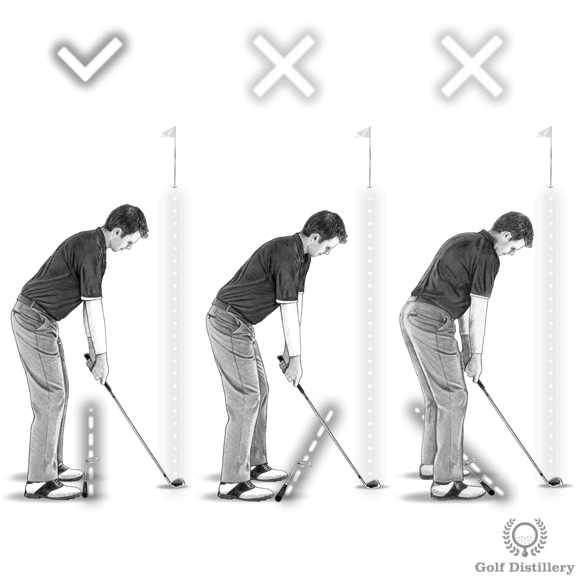
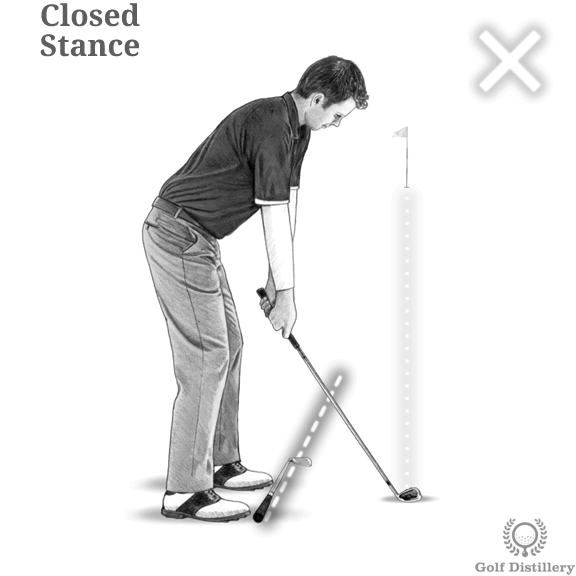
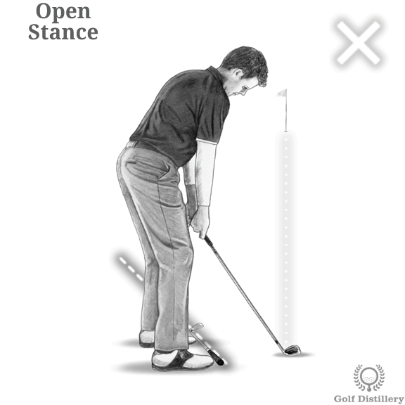
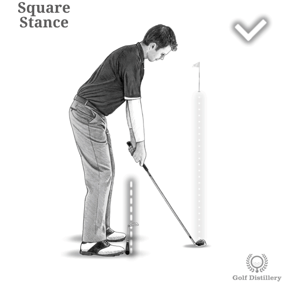
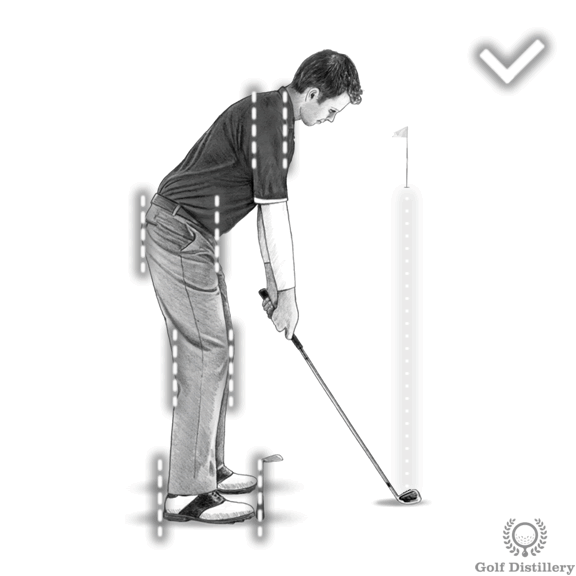
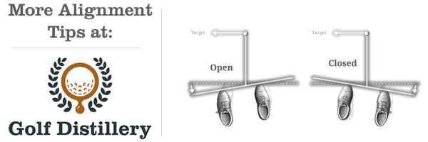

# Setup -golf alignment

### How to Line Up a Golf Shot Perfect Golf Setup  – Part 1

********

To check your alignment, pick a target in the distance and set up to the ball as normal. Place a club along the line of your toes, step back and see where the club points:\

If the club points directly at the target, or to the right of the target, your stance is what we call **closed**.

********

**i**f the club points way left of the left of the target, your stance is what we call **open**.

The club should point **parallel left** of the target (imagine the line along your feet and the line from the ball to the target are like 2 train tracks). This is a **square** stance.

Remember – your knees, hips and shoulders should be in line or parallel to your feet. If you can, have a friend hold a golf club across your hips and then your shoulders while you are in the set up position. Step away and check where this club is pointing.

Reference: [https://free-online-golf-tips.com/fundamental-golf-tips/golf-set-up-tips/proper-alignment-in-golf/](https://free-online-golf-tips.com/fundamental-golf-tips/golf-set-up-tips/proper-alignment-in-golf/)

