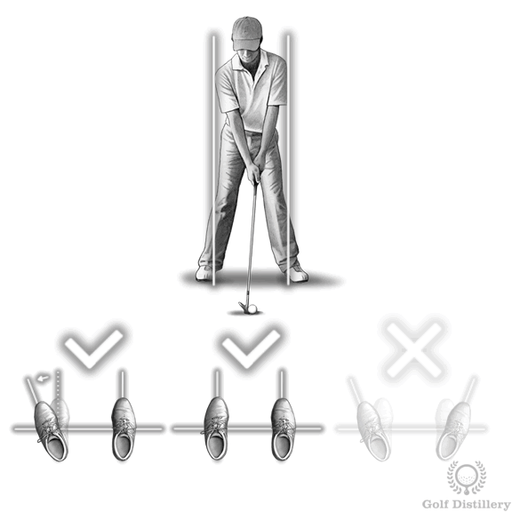
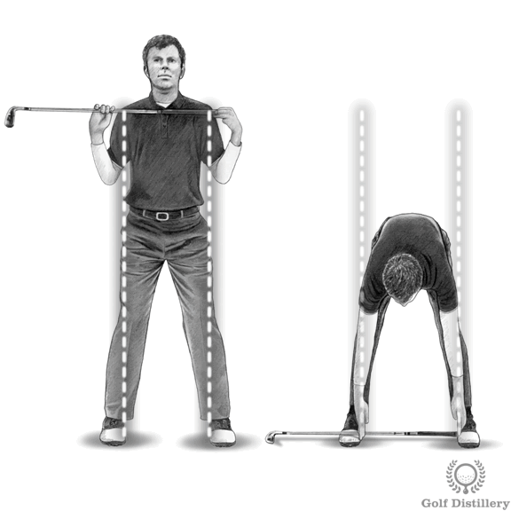
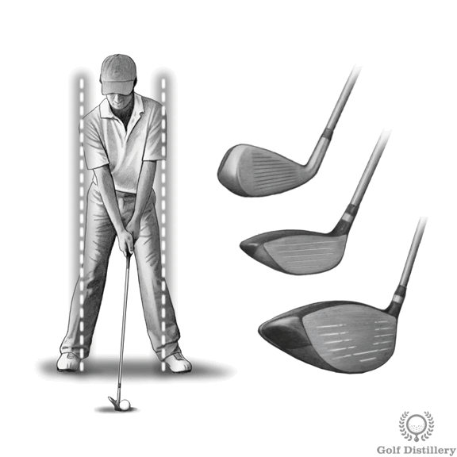
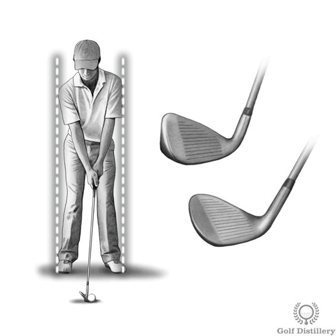
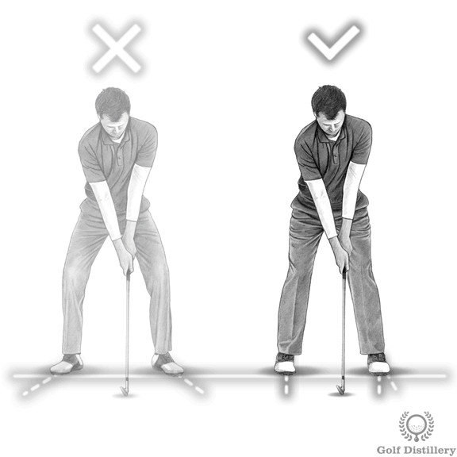

# Setup -- Proper Golf Stance

A golf stance is made up of several elements – the **right width of stance**, the right amount of **knee flex**, the **angle of the feet** and **overall posture**.

To ensure the correct width of your stance, measure the width of your shoulders using a club. Then make sure the **insides** of your feet are at least this wide apart for all full shots.

Widen your stance (insides of feet are **2-3 inches wider** than shoulder width) for l**onger clubs such as fairway woods and the driver.**

****

****

********

****

Reduce your stance width by an inch or two for short irons and wedges. For less than full shots (i.e. pitching and chipping, we don’t need a wide stance).  for example  **pitching** and **chipping**&#x20;

Avoid pointing your toes out at too much of an angle. Your rear foot should be at right angles to the target line. Your front foot can be angled outwards but only slightly.

*   Knees should be lightly flexed but not bent.\

    ***
* Your body weight should be spread 50/50 between your toes and heels as well as 50/50 between your left and right foot for most shots.

\

